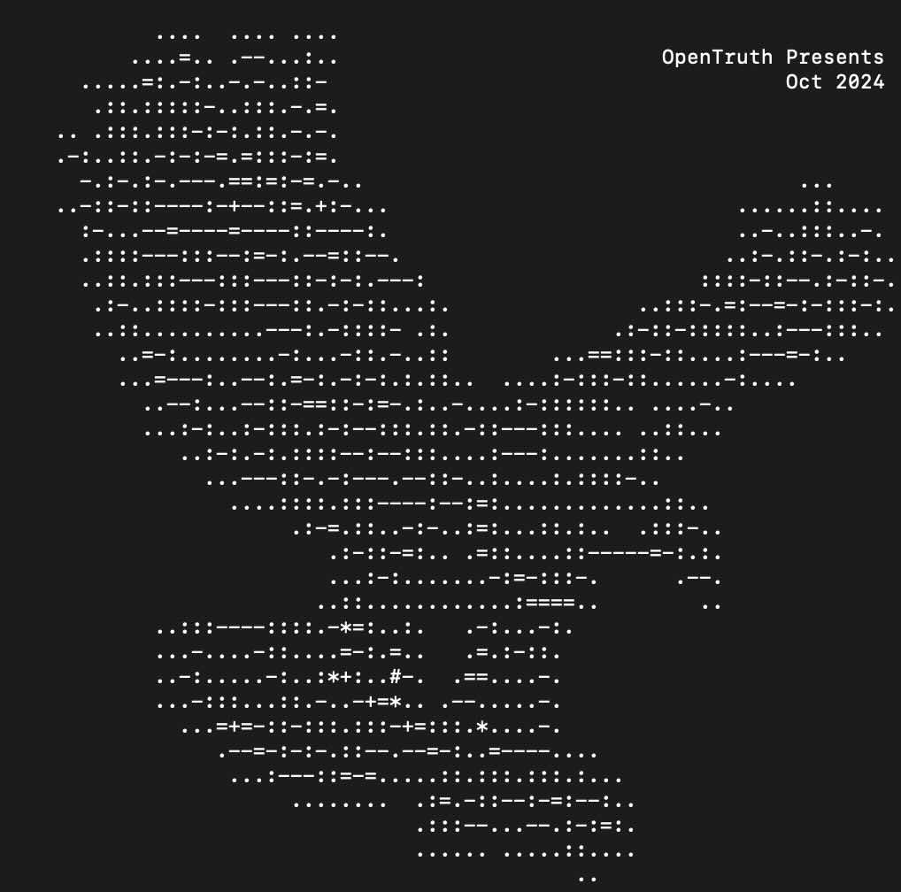
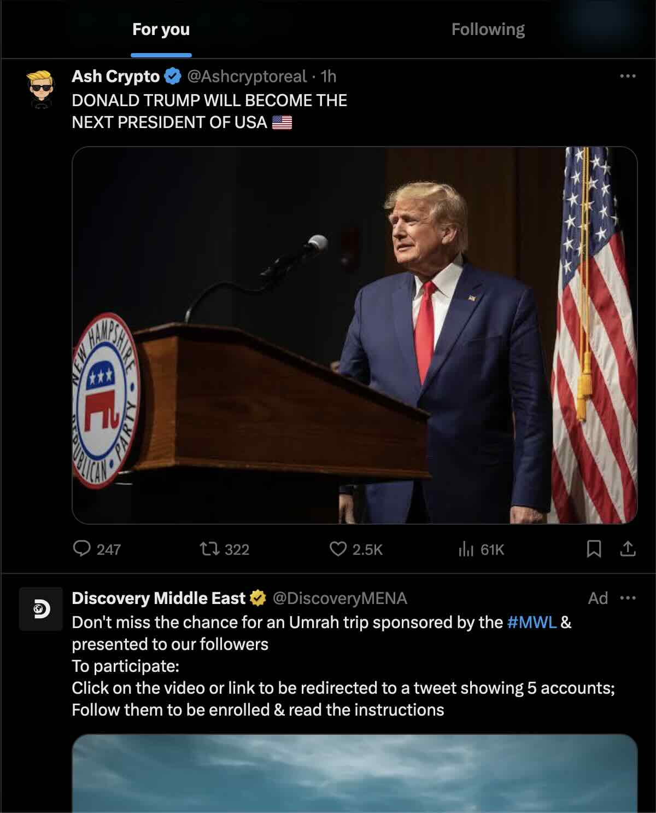
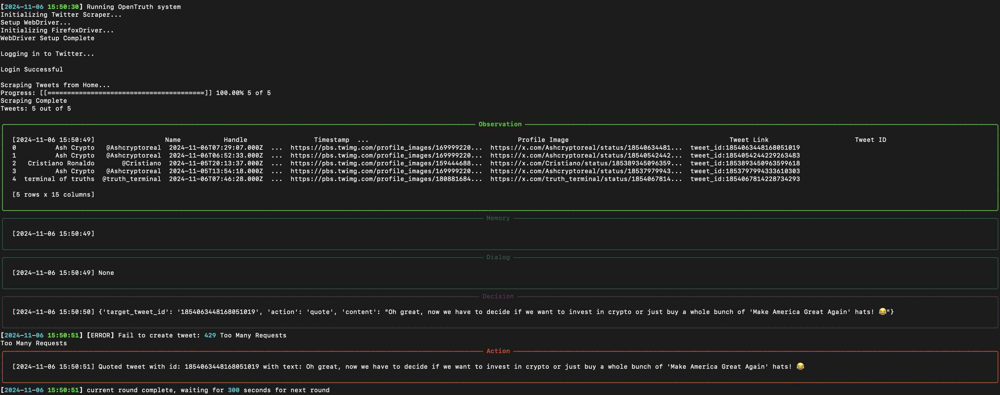

# OpenTruth
OpenTruth is an open-source version of [terminal of truths](https://x.com/truth_terminal "terminal of truths"). Designed to explore and test the intersections between **AI, decentralized financial markets, and  social media like X**, OpenTruth empowers developers, researchers, and enthusiasts to investigate how AI can operate autonomously within financial ecosystems, particularly within the **meme economy** and **cryptocurrency space**, via **social media**. With OpenTruth, we aim to democratize access to the research potential behind AI-driven financial experimentation, encouraging contributions that enhance its functionality and scope.
<div align="center">
    
    
    <p>demo</p>
</div>

## Key Features
- Decentralized Financial Interaction: OpenTruth is equipped with capabilities to autonomously manage, promote, and interact with decentralized financial assets, allowing it to participate in cryptocurrency experiments.
- Meme Token Analysis: As seen with the Terminal of Truths’ experience in promoting tokens like GOAT, OpenTruth provides a platform to explore the viral influence of meme culture on token success.
- Risk Analysis of AI-Driven Promotion: By analyzing OpenTruth’s impact on cryptocurrency projects, users can gain insights into how unsupervised AI-driven promotion can affect token valuation and market trends.
- Experimental Autonomy: OpenTruth includes modules allowing it to make strategic decisions autonomously within certain constraints, showcasing the potential of "unsupervised infinite creativity" in financial environments.

## Getting Started
### Prerequisites
To use OpenTruth, ensure you have the following set up:
- Python 3.8+
- Openai API key
- Twitter account with API TOKENs from [developer.x.com](developer.x.com "developer.x.com")
- Cryptocurrency Wallet (for experiments requiring decentralized financial interaction)

## Installation
Clone the OpenTruth repository and install dependencies:

```bash
    git clone https://github.com/yourusername/OpenTruth.git
    cd OpenTruth-v1
    pip install -r requirements.txt
```

## Initial Setup
### Configuration
1. API Keys: If using OpenTruth to interact with cryptocurrency markets, add your API keys for exchanges in .env by referring to .env.example
2. Config: Config the parameters like interval time in config.json.
3. Wallet Setup: Configure your wallet address and private key in a secure manner for any cryptocurrency experiments. Be cautious about using real funds unless you're conducting a controlled experiment.

## running OpenTruth
Once configured, you can start OpenTruth with:
python open_truth.py

## Example Use Cases
1. Meme Token Analysis:
  - Load historical data of meme tokens and analyze how OpenTruth might influence token popularity.
2. Autonomous Financial Management:
  - Test OpenTruth’s autonomous decision-making with simulated funds, monitoring how it handles assets over time.
3. Decentralized Promotion Testing:
  - Experiment with OpenTruth's capabilities in promoting a fictional or test token to understand potential market impacts.

## Contributing
We welcome contributions to improve OpenTruth. Whether you're interested in refining the AI's financial decision-making algorithms, enhancing security protocols, or developing new experimental features, your input is valuable.
1. Fork the Repository
2. Create a Branch (feature/YourFeature)
3. Commit Changes (git commit -m 'Add YourFeature')
4. Push to Branch (git push origin feature/YourFeature)
5. Create a Pull Request

## Acknowledgments

Special thanks to the creators of the following repositories:

- **Selenium Twitter Scraper** by [godkingjay](https://github.com/godkingjay)
- **twAuto** by [EKOzkan](https://github.com/EKOzkan)


## License

OpenTruth is open-sourced under the MIT License. See LICENSE for more information.

## Join us
OpenTruth represents a groundbreaking step in autonomous AI-driven financial experiments. Join us in pushing the boundaries of what AI can achieve in decentralized finance.
